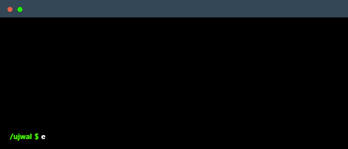

👋 Hi, I’m **@ujwal_sahu**  
👀 Interested in **ideas, startups, future tech**  
🌱 Currently learning **CS, AI, Dev**  
💞️ Open to collaborate on **world-changing ideas**  
📫 Reach me: **+91-8169060423**  




<hr>
<h3 align="center">Full Stack Web Development (MERN)</h3>

###

<div align="center">
  
  
  
  
  
  
  
  
  
  
  
  
  
  
  
  
  
  
  
  
  
  
  
  
  
</div>


<hr>

###

<h3 align="center">Data Science, AI</h3>

###

<div align="center">
  
  
  
  
  
  
  
  
  
  
  
</div>

###

<p align="left"></p>

###

<p align="left"></p>


<hr>
<h3 align="center">Python Web Development</h3>

###

<div align="center">
  
  
  
  
  
</div>

###
<hr>
<h3 align="center">Technologies</h3>

###

<div align="center">
  
  
  
  
  
  
  
  
  
  
  
  
  
</div>
 
###
<hr>
<br>
<div align="center">
  
  
</div>

###

<br clear="both">


<br>
<p>VS Code Stats:<p>
<!--START_SECTION:waka-->

```txt
From: 04 November 2025 - To: 11 November 2025

Python                9 hrs 43 mins   ████████████▓░░░░░░░░░░░░   50.97 %
C++                   4 hrs 28 mins   ██████░░░░░░░░░░░░░░░░░░░   23.41 %
Text                  2 hrs 8 mins    ██▓░░░░░░░░░░░░░░░░░░░░░░   11.25 %
Todotxt               1 hr 4 mins     █▒░░░░░░░░░░░░░░░░░░░░░░░   05.67 %
Git Config            1 hr 4 mins     █▒░░░░░░░░░░░░░░░░░░░░░░░   05.65 %
```

<!--END_SECTION:waka-->
<br>

###


<div align="left">
  <a href="https://www.linkedin.com/in/ujwal-sahu-107a641a0?utm_source=share&utm_campaign=share_via&utm_content=profile&utm_medium=android_app" target="_blank">
    
  </a>
</div>

###
